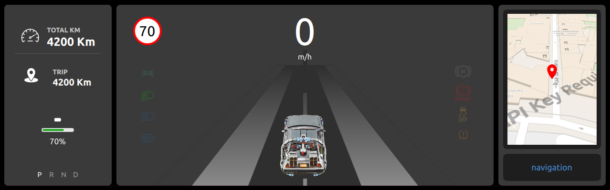
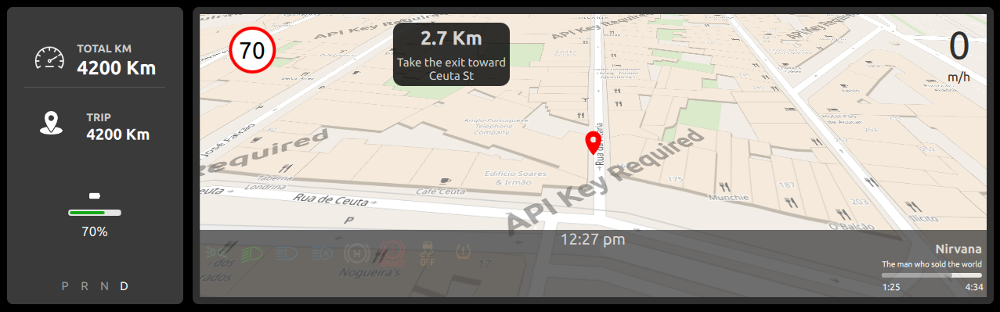
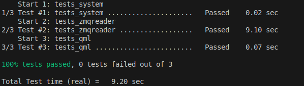
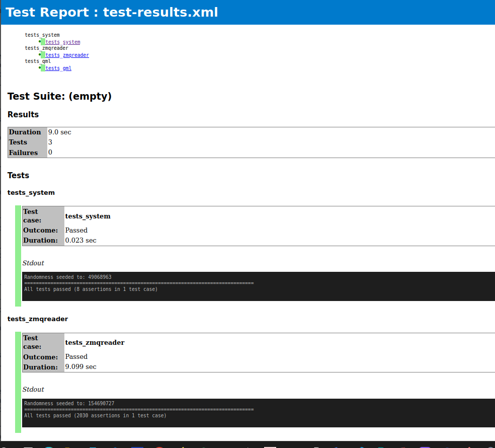

# Digital Cluster - Qt Automotive Interface

  
*Main interface of the digital cluster (example 1)*

  
*Main interface of the digital cluster (example 2)*

A digital cluster project developed in **Qt/QML** for embedded automotive systems, featuring real-time data integration via **ZeroMQ**. Includes:

- Left panel with vehicle information
- Navigation center with maps
- Media and telemetry controls
- Alert and diagnostics system

## 📁 Project Structure

```plaintext
Digital_Cluster/
├── main.cpp
├── Main.qml
├── System.cpp
├── System.h
├── zmqreader.cpp
├── zmqreader.h
├── ui/
│   ├── LeftPanel/       # Left panel (speedometer, gear info ...)
│   ├── CenterPanel/     # Navigation and main controls
│   └── assets/          # Icons and graphical resources
└── tests/               # Unit and integration tests
```

## ⚙️ Requirements

- **Qt 6.5.3+** (Quick, QmlTools)
- **CMake 3.16+**
- **ZeroMQ 4.3.4+**
- **C++17 Compiler**
- **lcov** (for coverage reports)

## 🚀 Build & Run

### On Raspberry Pi (ARM64)
```sh
mkdir build && cd build
cmake -DCMAKE_PREFIX_PATH=path/to/Qt6  -DQt6QmlTools_DIR=pat/to/Qt6QmlTools ..
make 
./appDigital_Cluster
```

### On Qt Creator
1. Open the main `CMakeLists.txt` file.
2. Configure a compatible kit (e.g., Qt 6.5.3 GCC).
3. Build (Ctrl+B) and Run (Ctrl+R).

## 🧪 Testing & Coverage

### Running tests (Ubuntu)
```sh
cd tests/
mkdir build && cd build
cmake .. -DCMAKE_PREFIX_PATH=/path/to/Qt6
make

# Run individual tests
./tests_zmqreader -s   # ZMQ communication tests
./tests_system -s      # System core tests
./tests_qml -s         # QML integration tests
ctest -V			   # All tests
```


  
*Example of the tests report generated*


### 📊 Generating Code Test Report
```sh
ctest --output-junit test-results.xml # generate report

#install dependencies
pip install junit2html

#convert XML to HTML
/path/to/junit2html test-results.xml test-results.html

# Open the report
xdg-open test-results.html  # Linux
open test-results.html      # macOS
start test-results.html     # Windows
```

  
*Example of the tests report generated*


### 📊 Generating Code Coverage Report
```sh
# Install dependencies
sudo apt-get install lcov gcc

# Capture coverage data
lcov --capture --directory . --output-file coverage.info

# Filter results
lcov --extract coverage.info "/path/to/Digital_Cluster/*" --output-file extracted.info
lcov --remove extracted.info "/path/to/Digital_Cluster/tests/*" --output-file filtered_coverage.info

# Generate HTML report
genhtml filtered_coverage.info --output-directory coverage_report

# Open the report
xdg-open coverage_report/index.html  # Linux
open coverage_report/index.html      # macOS
start coverage_report/index.html     # Windows
```

  
*Example of the coverage report generated by lcov*

---

### 🔧 Technical Notes:
- **ZMQ communication** is set on **port 5555 (TCP)**.


Developed by: Team07 - SEA:ME Portugal  

